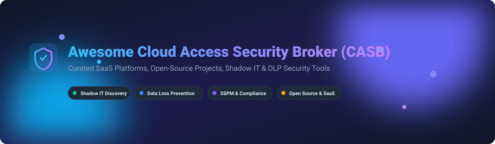

# 🛡️ Awesome Cloud Access Security Broker (CASB)

  
  
  
  
  

---

## 🔍 Overview & SEO Keywords

A curated collection of top-tier **Cloud Access Security Broker (CASB)** SaaS platforms, open-source projects, and security building blocks. This list covers **Shadow IT Discovery**, **Data Loss Prevention (DLP)**, **SaaS Security Posture Management (SSPM)**, **User and Entity Behavior Analytics (UEBA)**, and **Cloud Threat Protection**.

Whether you are a **Cloud Security Architect**, **CISO**, **SOC Analyst**, or **DevSecOps Engineer**, this repository provides transparent market data, enterprise pricing baselines, free trial details, and open-source tooling for securing cloud applications.

---

## 📖 Table of Contents

- [☁️ SaaS & Hosted CASB Platforms](#%EF%B8%8F-saas--hosted-casb-platforms)
- [🔓 Open-Source GitHub Projects](#-open-source-github-projects)
- [🤝 How to Contribute](#-how-to-contribute)
- [☕ Support](#-support)
- [⭐ Star History](#-star-history)
- [⚠️ Disclaimer](#%EF%B8%8F-disclaimer)

---

## ☁️ SaaS & Hosted CASB Platforms

> 📊 **Market Overview & Industry Concentration**: The global CASB market is estimated at **~$6.2B in 2026**, projected to grow to **~$15.8B by 2031** at a **~20.5% CAGR**. The sector is **moderately concentrated** among top enterprise leaders (Microsoft, Cisco, Broadcom/Symantec, Palo Alto Networks, Netskope, and Zscaler), while the mid-market remains fragmented across specialized SASE/SSE vendors without a single winner-take-all monopoly.

*Sorted by Company Size / Market Revenue (Descending)*

| Platform | Description | Pricing (Starting Tier) | Free Tier Limits | Company Size / Valuation |
|:---|:---|:---|:---|:---|
| 🛡️ **[Microsoft Defender for Cloud Apps](https://www.microsoft.com/en-us/security/business/siem-and-xdr/microsoft-defender-cloud-apps)** | Comprehensive CASB integrated into Microsoft Defender XDR offering Shadow IT discovery, SaaS security, DLP, and AI agent monitoring. | **~$12.99/user/month** (standalone annual via authorized reseller CDW). | **30-day free trial** of Defender for Cloud Apps; malware scanning add-on excluded. | **~$281B Revenue** (Microsoft FY2025) |
| 🔒 **[Cisco Cloudlock](https://www.cisco.com/site/us/en/products/security/cloud-security/cloudlock/index.html)** | Cloud-native API-driven CASB specializing in user, data, and SaaS app security with FedRAMP High certification. | **~$10.00/user/month** (starting enterprise tier baseline). | **14-day free trial** upon enterprise request with full API integration test. | **~$63B Revenue** (Cisco FY2025) |
| 🌐 **[Broadcom Symantec CloudSOC](https://www.broadcom.com/products/cybersecurity/cloud/cloudsoc-casb)** | Enterprise CASB and Cloud DLP with Securlets (API) and Gatelets (inline) protection. | **~$22.00/user/year** (bundled baseline renewal rate). | **30-day sandbox trial** available for existing Broadcom enterprise customers. | **~$51B Revenue** (Broadcom FY2025 est.) |
| ⚡ **[Palo Alto Prisma Access CASB](https://www.paloaltonetworks.com/sase/casb)** | Next-Generation CASB embedded in Prisma Access SASE platform with inline ML & API DLP. | **~$45.00/user/year** (Prisma Access SASE add-on tier starting price). | **90-day free trial** under US Public Sector SASE evaluation program. | **~$9.2B Revenue** (Palo Alto Networks FY2025) |
| ☁️ **[Netskope CASB](https://www.netskope.com/products/casb)** | Market leader in cloud security with 80,000+ app visibility, inline inspection, and Cloud Confidence Index. | **~$134.40/user/year** (CASB API 100-user minimum starting package). | **14-day self-paced lab trial** access on Netskope One platform. | **~$7.06B Market Cap** / ~$803M Revenue |
| 🚀 **[Zscaler Cloud Protection](https://www.zscaler.com/products/casb)** | Inline proxy and API-based CASB embedded in Zscaler Zero Trust Exchange SSE platform. | **~$36.00/user/year** (Business Edition SASE entry bundle). | **30-day free trial** of Advanced Cloud Sandbox and CASB API module. | **~$3.35B Revenue** (Zscaler FY2026) |
| 🔑 **[Trend Micro Cloud App Security](https://www.trendmicro.com/en_us/business/products/user-protection/sasp/cloud-app-security.html)** | API-based CASB focused on SaaS email, file sharing, data loss prevention, and malware detection. | **~$3.50/user/month** (Tier A 5–499 users package). | **30-day full feature free trial** via Customer Licensing Portal (CLP). | **~$1.8B Revenue** (Trend Micro FY2025) |
| 🔐 **[Skyhigh Security](https://www.skyhighsecurity.com/products/cloud-access-security-broker.html)** | Enterprise CASB featuring 261-point risk scoring Cloud Registry and autonomous remediation. | **~$40.00/user/year** (Enterprise Core package baseline). | **14-day assisted proof-of-concept trial** upon sales validation. | **~$1.5B Revenue Est.** (Private spinout) |
| 📱 **[Lookout CASB](https://www.lookout.com/products/casb)** | Secure Cloud Access CASB with real-time DLP, UEBA risk scoring, and digital rights management. | **~$40.00/user/year** (Essential Plan up to 5 protected apps). | **30-day free trial** via Slack / Microsoft 365 marketplace add-on. | **~$1.5B Valuation** ($200M+ raised) |
| 🛡️ **[Forcepoint CASB](https://www.forcepoint.com/product/casb-cloud-access-security-broker)** | Unified inline and API CASB with 1,800+ pre-defined data security policies and agentless access. | **~$129.99/user/year** (Forcepoint ONE CASB CDW commercial listing). | **30-day free trial** of Forcepoint Cloud DLP endpoint & CASB engine. | **~$1.3B Revenue Est.** (Private) |

---

## 🔓 Open-Source GitHub Projects

> 💡 **Open-Source Reality Check**: Full-featured open-source CASB platforms are rare due to the sheer complexity of maintaining API connectors for thousands of SaaS apps. However, production-grade **open-source building blocks** (CSPM, DLP scanners, SIEM engines, and proxy brokers) enable security teams to assemble custom CASB architectures.

*Sorted by GitHub Stars_Count (Descending)*

1. 🟢 **[Prowler](https://github.com/prowler-cloud/prowler)** — Open-source Multi-Cloud Security Posture Management (CSPM) and SaaS Security Posture Management (SSPM) for AWS, Azure, GCP, Kubernetes, Microsoft 365, GitHub, and Okta. Features over 800+ automated security compliance checks.  
   

2. 🛡️ **[Wazuh](https://github.com/wazuh/wazuh)** — Free and open-source enterprise SIEM, XDR, and cloud security monitoring engine. Supports log analysis, file integrity monitoring, threat detection, and automated compliance auditing (GDPR, PCI-DSS, HIPAA).  
   

3. 🔍 **[ScoutSuite](https://github.com/nccgroup/ScoutSuite)** — Multi-cloud security auditing tool developed by NCC Group. Audits AWS, Azure, GCP, Alibaba Cloud, and Oracle Cloud Infrastructure (OCI) for security misconfigurations.  
   

4. 🔑 **[pleno-dlp](https://github.com/plenoai/pleno-dlp)** — High-performance secret and PII scanner for Data Loss Prevention pipelines. Scans filesystems, archives, and stdin for 800+ secret types and custom regex PII patterns with SARIF report output.  
   

5. 👁️ **[Nightfall sensitive-data-scanner](https://github.com/nightfallai/sensitive-data-scanner)** — Open-source PII, credential, and API key scanner engine designed for embedding into cloud data ingestion pipelines and DLP proxies.  
   

6. ⚡ **[ReliableSecurity/cloud-security-broker](https://github.com/ReliableSecurity/cloud-security-broker)** — Production-ready open-source Cloud Security Broker featuring automatic data encryption, MFA enforcement, DLP rules, and mass download anomaly alerts for cloud storage.  
   

7. 🧪 **[Tanitay/Cloud-Access-Security-Broker-Project](https://github.com/Tanitay/Cloud-Access-Security-Broker-Project)** — Educational CASB reference architecture demonstrating data security policies, access controls, and activity logging on AWS and Google Cloud Platform.  
   

---

## 🤝 How to Contribute

Contributions are highly welcome! To suggest a new CASB platform or open-source security tool:

1. Fork this repository.
2. Update `README.md` following the table or list schema.
3. Ensure factual starting price baselines and exact free trial limits are provided.
4. Submit a Pull Request with a clear description of changes.

For more awesome lists, explore [Awesome Awesome Awesome](https://github.com/ishandutta2007/Awesome-Awesome-Awesome).

---

## ☕ Support

If you found this CASB security reference useful, please consider supporting the project:

- ⭐ **Star** this repository to increase visibility.
- 🔀 **Fork** and contribute new tools or updated pricing.
- 💖 **Sponsor / Buy me a coffee**: Support ongoing open-source cybersecurity curation via [GitHub Sponsors](https://github.com/sponsors/ishandutta2007).

---

## ⭐ Star History

---

## ⚠️ Disclaimer

- This list is **community-curated** for educational, architectural, and security evaluation purposes.
- Enterprise contract rates vary significantly based on user volume, licensing tiers, and SASE/SSE bundling. Always consult vendor sales for binding commercial quotes.
